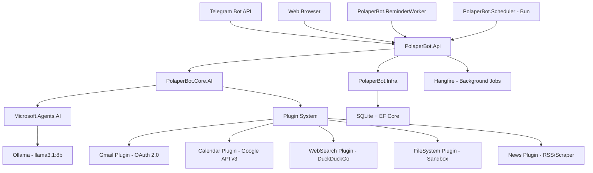
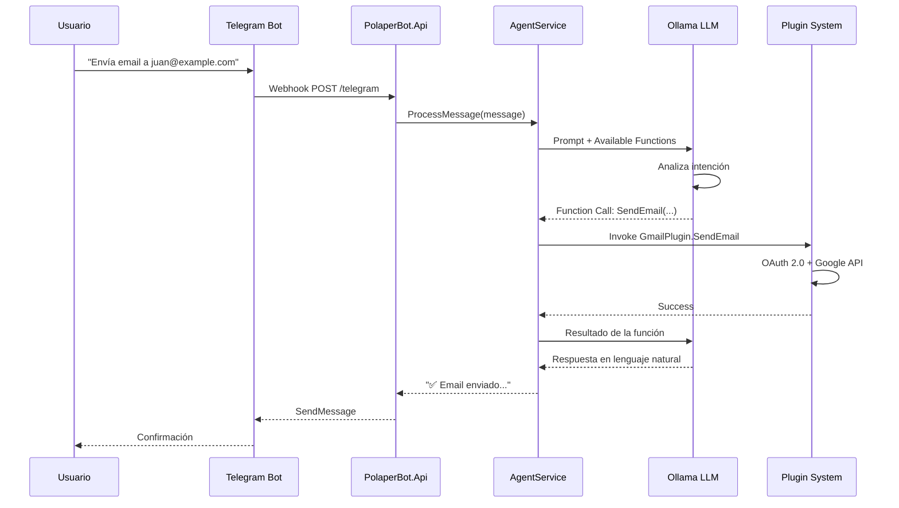

# 🤖 PolaperBot

<div align="center">


**Un asistente personal inteligente con arquitectura de agentes IA, integración multi-plataforma y capacidades avanzadas de automatización**

[](https://dotnet.microsoft.com/)
[](https://react.dev/)
[](https://ollama.ai/)
[](https://telegram.org/)
[](https://threejs.org/)

</div>

---

## 📋 Visión General

**PolaperBot** es un asistente personal conversacional multi-modal que combina procesamiento de lenguaje natural avanzado, integración con servicios externos, y una interfaz web interactiva con avatar 3D. Construido con una arquitectura orientada a plugins sobre el framework **Microsoft.Agents.AI**, permite extensibilidad y escalabilidad mediante componentes modulares.

### 🎯 Casos de Uso

- **Automatización de Tareas**: Envío de emails, gestión de calendario, recordatorios programados
- **Gestión de Información**: Búsqueda web inteligente, scraping de contenido, almacenamiento estructurado
- **Interacción Natural**: Conversación fluida en español mediante IA local (privacidad garantizada)
- **Control del Sistema**: Ejecución de comandos, gestión de archivos, integración con herramientas locales
- **Interfaz Multicanal**: Telegram para móvil, interfaz web con avatar 3D para escritorio

### ✨ Características Destacadas

#### 🤖 Inteligencia Artificial
- **Modelo Local**: Ollama (llama3.1:8b-instruct) - Sin envío de datos a la nube
- **Framework**: Microsoft.Agents.AI con soporte para Function Calling
- **Arquitectura de Agentes**: Sistema modular con 10+ plugins especializados
- **Procesamiento Contextual**: Memoria de conversación y análisis semántico

#### 🌐 Integraciones Externas
- **Google Workspace**: Gmail (OAuth 2.0), Calendar (API v3)
- **Web Scraping**: DuckDuckGo, AngleSharp, HtmlAgilityPack
- **Telegram Bot API**: Webhooks, inline queries, comandos personalizados
- **RSS Feeds**: Agregación automática de noticias de múltiples fuentes

#### 💻 Interfaz Web Moderna
- **Frontend**: React 18 + Vite con diseño Wabi-Sabi minimalista
- **Avatar 3D**: Modelo Komi-san animado con Three.js (GLTF/GLB)
- **Estados de Animación**: IDLE, THINKING, SPEAKING con transiciones suaves
- **Responsive Design**: Optimizado para desktop y tablet

#### 🔧 Backend Robusto
- **.NET 10 Minimal API**: Alta performance, bajo overhead
- **SQLite + EF Core**: Persistencia ligera con migraciones automáticas
- **Serilog**: Logging estructurado con rotación diaria
- **Hangfire**: Procesamiento de tareas en background (recordatorios, noticias)

---

## 🏗️ Arquitectura

### Stack Tecnológico Completo



### Estructura de Proyectos

```
PolaperBot/
├── PolaperBot.Api/              # 🌐 ASP.NET Core Minimal API
│   ├── Endpoints/               #    - HumanEndpoints (chat)
│   ├── wwwroot/                 #    - NewsEndpoints, NotificationEndpoints
│   └── Program.cs               #    - TelegramWebhookEndpoints
│
├── PolaperBot.Core.AI/          # 🤖 Motor de IA y Sistema de Plugins
│   ├── Agents/                  #    - HanniAgent (Microsoft.Agents.AI)
│   ├── Plugins/                 #    - 10+ plugins funcionales
│   │   ├── GmailPlugin.cs       #      • OAuth 2.0, Google.Apis.Gmail
│   │   ├── CalendarPlugin.cs    #      • Google Calendar API v3
│   │   ├── WebSearchPlugin.cs   #      • DuckDuckGo + AngleSharp
│   │   ├── FileSystemPlugin.cs  #      • Sandbox filesystem access
│   │   ├── NewsPlugin.cs        #      • RSS feeds + web scraping
│   │   └── ...
│   └── Services/
│       ├── OllamaService.cs     #      • OllamaSharp integration
│       └── AgentService.cs      #      • Agent orchestration
│
├── PolaperBot.Infra/            # 💾 Capa de Persistencia
│   ├── Data/
│   │   └── AppDbContext.cs      #      • EF Core + SQLite
│   ├── Entities/                #      • Reminder, Restaurant, NewsItem
│   └── Repositories/            #      • Generic repository pattern
│
├── PolaperBot.ReminderWorker/   # ⏰ Background Worker (.NET)
│   └── ReminderWorker.cs        #      • Hosted service para recordatorios
│
├── PolaperBot.Scheduler/        # 📅 Cron Jobs (TypeScript + Bun)
│   ├── index.ts                 #      • Bree job scheduler
│   └── jobs/                    #      • News fetching, cleanup tasks
│
└── polaperbot-web/              # 🎨 Frontend React + Three.js
    ├── src/
    │   ├── components/
    │   │   └── KomiAvatar.jsx   #      • Three.js 3D avatar
    │   ├── pages/
    │   │   ├── ChatPage.jsx     #      • Real-time chat interface
    │   │   ├── NewsPage.jsx     #      • News aggregator
    │   │   └── SearchPage.jsx   #      • Web search + analysis
    │   └── hooks/
    │       └── useChat.js       #      • WebSocket/Polling chat logic
    └── vite.config.js           #      • Build configuration
```

---

## 🛠️ Stack Tecnológico Detallado

### 🖥️ Backend & IA

| Tecnología | Versión | Propósito |
|-----------|---------|-----------|
| **[.NET](https://dotnet.microsoft.com/)** | 10.0 | Framework backend principal |
| **[C#](https://learn.microsoft.com/en-us/dotnet/csharp/)** | 13.0 | Lenguaje de programación con nullable reference types |
| **[Microsoft.Agents.AI](https://www.nuget.org/packages/Microsoft.SemanticKernel)** | Latest | Framework de orquestación de agentes IA con Function Calling |
| **[Ollama](https://ollama.ai/)** | - | Runtime local para LLMs (llama3.1:8b-instruct) |
| **[OllamaSharp](https://github.com/awaescher/OllamaSharp)** | - | Cliente .NET para integración con Ollama |

### 📦 Librerías de IA & NLP

- **Microsoft.SemanticKernel** - Orquestación de prompts, plugins y memoria
- **System.Text.Json** - Serialización de mensajes y respuestas
- **Function Calling** - Invocación de funciones dinámicas desde LLM

### 🔌 Integraciones de APIs

| Servicio | Librería | Autenticación | Funcionalidad |
|----------|----------|---------------|---------------|
| **Gmail** | `Google.Apis.Gmail.v1` | OAuth 2.0 | Envío, lectura y gestión de correos |
| **Google Calendar** | `Google.Apis.Calendar.v3` | OAuth 2.0 | Creación/lectura de eventos |
| **Telegram** | `Telegram.Bot` | Bot Token | Bot API, webhooks, comandos |
| **DuckDuckGo** | `HtmlAgilityPack` + Custom | - | Búsqueda web sin API key |

### 🗄️ Persistencia & Datos

- **[Entity Framework Core](https://learn.microsoft.com/en-us/ef/core/)** 10.0 - ORM moderno con LINQ
- **[SQLite](https://www.sqlite.org/)** - Base de datos embebida sin configuración
- **Microsoft.EntityFrameworkCore.Sqlite** - Provider EF Core para SQLite
- **Repository Pattern** - Abstracción de acceso a datos

### 🎨 Frontend

| Tecnología | Versión | Propósito |
|-----------|---------|-----------|
| **[React](https://react.dev/)** | 18.3 | Framework UI con hooks y context |
| **[Vite](https://vitejs.dev/)** | 6.x | Build tool ultra-rápido con HMR |
| **[Three.js](https://threejs.org/)** | r169 | Renderizado 3D del avatar Komi-san |
| **[@react-three/fiber](https://docs.pmnd.rs/react-three-fiber)** | - | React renderer para Three.js |
| **[@react-three/drei](https://github.com/pmndrs/drei)** | - | Helpers para Three.js (useGLTF, OrbitControls) |
| **TailwindCSS** | 3.x | Utility-first CSS framework |

### ⚡ Procesamiento Asíncrono

- **[Hangfire](https://www.hangfire.io/)** - Background job processing con dashboard
- **Hosted Services** (.NET) - Workers de larga duración
- **[Bun](https://bun.sh/)** - Runtime JavaScript/TypeScript ultra-rápido
- **[Bree](https://github.com/breejs/bree)** - Job scheduler para Node.js

### 🔍 Web Scraping & Parsing

- **[AngleSharp](https://anglesharp.github.io/)** - Parser HTML/CSS compatible con WHATWG
- **[HtmlAgilityPack](https://html-agility-pack.net/)** - HTML parser con XPath
- **HttpClient** - Cliente HTTP nativo de .NET con HttpClientFactory

### 📝 Logging & Monitoreo

- **[Serilog](https://serilog.net/)** - Logging estructurado
  - Sink: Console (desarrollo)
  - Sink: File con rolling diario (producción)
- **[Serilog.AspNetCore](https://github.com/serilog/serilog-aspnetcore)** - Integración con ASP.NET Core

---

## 🚀 Sistema de Plugins

El asistente utiliza un sistema modular basado en **Microsoft.Agents.AI** con soporte nativo para Function Calling. Cada plugin expone métodos decorados con atributos `[KernelFunction]` que el LLM puede invocar dinámicamente.

### Plugins Disponibles

| Plugin | Métodos | Librerías Clave | Descripción |
|--------|---------|-----------------|-------------|
| 🌐 **WebSearchPlugin** | `SearchWeb`<br>`SearchAndScrape`<br>`ScrapeUrl`<br>`SearchAndAnalyze`<br>`SearchNews` | HtmlAgilityPack<br>AngleSharp<br>HttpClient | Búsqueda en DuckDuckGo, scraping de páginas, extracción de contenido con selectores CSS |
| 📧 **GmailPlugin** | `SendEmail`<br>`GetEmailsSummary` | Google.Apis.Gmail.v1<br>Google.Apis.Auth | Envío de correos con OAuth 2.0, resumen de bandeja de entrada por fecha |
| 📅 **CalendarPlugin** | `CreateEvent`<br>`ListUpcomingEvents`<br>`DeleteEvent` | Google.Apis.Calendar.v3 | Gestión completa de eventos con recordatorios |
| 🍽️ **RestaurantsPlugin** | `AddRestaurant`<br>`SearchRestaurants`<br>`ListFavorites`<br>`AddReview` | EF Core<br>SQLite | CRUD de restaurantes con búsqueda fuzzy y sistema de reseñas |
| ⏰ **RemindersPlugin** | `CreateReminder`<br>`ListReminders`<br>`DeleteReminder` | Hangfire<br>EF Core | Recordatorios programados con envío automático vía Telegram |
| 💾 **FileSystemPlugin** | `ReadFile`<br>`WriteFile`<br>`ListDirectory`<br>`DeleteFile` | System.IO<br>Path validation | Operaciones de archivos dentro de sandbox configurable |
| 📝 **ObsidianPlugin** | `CreateNote`<br>`CreateDailyNote`<br>`CreateRecommendation` | System.IO<br>Frontmatter YAML | Creación de notas Markdown con metadatos YAML |
| 🐧 **BashPlugin** | `ExecuteCommand` | System.Diagnostics<br>Process | Ejecución de comandos shell (configurado solo en Linux) |
| 📰 **NewsPlugin** | `FetchAndStoreNews`<br>`GetNewsByCategory`<br>`GetRecentNewsSummary` | AngleSharp<br>HttpClient<br>RSS Parsing | Agregación de noticias de múltiples fuentes (Tech, IA, Gaming) |
| 🔔 **NotificationsPlugin** | `CreateNotification`<br>`GetUnreadNotifications`<br>`MarkAsRead` | EF Core<br>Telegram.Bot | Sistema de notificaciones multi-canal con prioridades |
| 🔗 **LinksPlugin** | `SaveLink`<br>`SearchLinks`<br>`GetLinksByTag` | EF Core | Gestor de marcadores con etiquetas y búsqueda |

### Ejemplo de Plugin

```csharp
public class WebSearchPlugin
{
    [KernelFunction("search_web")]
    [Description("Busca información en internet usando DuckDuckGo")]
    public async Task<string> SearchWeb(
        [Description("Consulta de búsqueda")] string query,
        [Description("Número de resultados")] int maxResults = 5)
    {
        // Implementación con HtmlAgilityPack
        var results = await _searchService.SearchAsync(query, maxResults);
        return JsonSerializer.Serialize(results);
    }
}
```

El LLM recibe la descripción del plugin y decide cuándo invocarlo basándose en el contexto de la conversación.

---

## 📦 Instalación y Configuración

> ⚠️ **Nota**: Este proyecto contiene código privado y no está disponible públicamente. Las instrucciones son para referencia sobre cómo se ejecuta el sistema.

### Requisitos del Sistema

#### Software Base
- **Sistema Operativo**: Linux (recomendado) o Windows 10/11
- **[.NET 10 SDK](https://dotnet.microsoft.com/download)** - Para compilar y ejecutar los proyectos C#
- **[Bun](https://bun.sh/)** v1.3+ - Runtime para el scheduler TypeScript
- **[Ollama](https://ollama.ai/)** - Para ejecutar el modelo de IA local

#### Modelo de IA
```bash
# Descargar e instalar el modelo llama3.1:8b-instruct
ollama pull llama3.1:8b-instruct

# Verificar instalación
ollama list

# Iniciar el servidor (por defecto en http://localhost:11434)
ollama serve
```

#### Credenciales Externas (Configuración Manual)
- **Telegram Bot Token**: Obtenido de [@BotFather](https://t.me/BotFather)
- **Google Cloud Project**: Credenciales OAuth 2.0 para Gmail y Calendar APIs
- **Chat ID de Telegram**: ID del chat donde el bot enviará notificaciones

### Estructura de Configuración

#### 1. API Backend (`PolaperBot.Api/appsettings.json`)

```jsonc
{
  "Database": {
    "SqlitePath": "C:/PolaperBot/Data/polaperbot.db",  // Ruta a la BD
    "HangfireSqlitePath": "C:/PolaperBot/Data/hangfire.db"
  },
  "Telegram": {
    "BotToken": "<TU_BOT_TOKEN>",
    "MainChatId": "<TU_CHAT_ID>"
  },
  "Gmail": {
    "CredentialsPath": "/ruta/a/gmail_credentials.json",
    "TokenFolder": "/ruta/a/gmail_token"
  },
  "Ollama": {
    "ApiUrl": "http://localhost:11434",
    "ModelName": "llama3.1:8b-instruct",
    "TimeoutSeconds": 60
  },
  "FileSystem": {
    "SandboxPath": "/ruta/al/sandbox",
    "ObsidianVaultPath": "/ruta/a/obsidian/vault"
  }
}
```

#### 2. Frontend (`polaperbot-web/.env`)

```bash
VITE_API_URL=http://localhost:5142
VITE_AVATAR_MODEL=/models/komi-san.glb
```

#### 3. Scheduler (`PolaperBot.Scheduler/config.ts`)

```typescript
export const config = {
  apiBaseUrl: 'http://localhost:5142',
  jobs: {
    fetchNews: {
      enabled: true,
      cron: '0 */6 * * *' // Cada 6 horas
    }
  }
};
```

### Compilación y Ejecución

#### Método 1: Scripts de Inicio (Linux)

```bash
# Iniciar todos los servicios
./start.sh

# Solo desarrollo (sin compilar frontend)
./start-dev.sh
```

#### Método 2: Manual

**Backend API:**
```bash
cd PolaperBot.Api
dotnet restore
dotnet run --configuration Release
# Escucha en http://localhost:5142
```

**Scheduler (Bun):**
```bash
cd PolaperBot.Scheduler
bun install
bun run index.ts
```

**Frontend (Desarrollo):**
```bash
cd polaperbot-web
npm install
npm run dev
# Acceso en http://localhost:5173
```

**Frontend (Producción):**
```bash
cd polaperbot-web
npm run build
npm run build:copy  # Copia a PolaperBot.Api/wwwroot
```

### Despliegue en Windows

**Publicación precompilada:**
```powershell
# Desde la raíz del proyecto
dotnet publish PolaperBot.Api/PolaperBot.Api.csproj -c Release -o PUBLICACION/Api

# Copiar Scheduler
Copy-Item -Recurse PolaperBot.Scheduler/* PUBLICACION/Scheduler/
cd PUBLICACION/Scheduler
bun install

# Ejecutar
cd PUBLICACION/Api
.\PolaperBot.Api.exe
```

---

## 🎯 Casos de Uso y Ejemplos

### 💬 Interfaz Web con Avatar 3D

El frontend React ofrece una experiencia inmersiva con un avatar 3D del personaje Komi-san que responde visualmente al estado del asistente:

**Características del Avatar:**
- **Modelo 3D**: GLTF/GLB renderizado con Three.js y @react-three/fiber
- **Animaciones**:
  - `IDLE`: Respiración sutil con movimientos aleatorios de cabeza
  - `THINKING`: Animación pensativa mientras procesa la consulta
  - `SPEAKING`: Movimientos activos durante la respuesta
- **Controles**: OrbitControls para rotar la cámara, zoom con scroll
- **Iluminación**: Directional + Ambient lights con sombras suaves

**Páginas Disponibles:**

```
http://localhost:5142/
├── /                     # Chat principal con avatar animado
├── /news                 # Agregador de noticias (Tech, IA, Gaming)
├── /notifications        # Centro de notificaciones y alertas
└── /search               # Búsqueda web con análisis inteligente
```

### 📱 Interacción por Telegram

El bot responde a lenguaje natural y decide qué plugins invocar automáticamente:

**Ejemplo 1: Gestión de Email**
```
Usuario: Envíale un correo a juan@example.com con el asunto "Reunión" 
         diciéndole que nos vemos mañana a las 10:00

Bot: 📧 ✅ Email enviado correctamente a juan@example.com
     Asunto: Reunión
     Hora de envío: 14:23
```

**Ejemplo 2: Calendario y Recordatorios**
```
Usuario: Recuérdame comprar leche mañana a las 18:00

Bot: ⏰ ✅ Recordatorio creado:
     📅 Fecha: 15/02/2026 a las 18:00
     📝 Mensaje: "Comprar leche"
     ID: REM-123

[Al día siguiente a las 18:00]
Bot: 🔔 ⏰ Recordatorio: Comprar leche
```

**Ejemplo 3: Búsqueda Web con Análisis**
```
Usuario: Busca las últimas noticias sobre IA generativa

Bot: 🔍 Buscando información...
     
     📰 Encontré 8 artículos relevantes:
     
     1. "OpenAI lanza GPT-5 con razonamiento avanzado"
        🔗 techcrunch.com/...
        📅 Hace 2 horas
     
     2. "Google Gemini 2.0 supera benchmarks"
        🔗 theverge.com/...
        📅 Hace 4 horas
     
     📊 Resumen: La tendencia actual en IA generativa se enfoca 
     en modelos multimodales y razonamiento...
```

**Ejemplo 4: Sistema de Archivos**
```
Usuario: Muéstrame el contenido del archivo notas.txt

Bot: 📄 Contenido de /sandbox/notas.txt:
     
     ```
     - Comprar ingredientes
     - Llamar al médico
     - Revisar correos pendientes
     ```
     
     (Última modificación: 10/02/2026)
```

**Ejemplo 5: Restaurantes con Búsqueda Contextual**
```
Usuario: ¿Conoces algún restaurante italiano bueno cerca del centro?

Bot: 🍽️ Encontré 3 restaurantes italianos:
     
     ⭐⭐⭐⭐⭐ La Trattoria
     📍 Calle Mayor 45, Centro
     💰 Precio medio: 25€
     📝 Nota: "Pasta casera excepcional"
     
     ⭐⭐⭐⭐ Pizzería Napoli
     📍 Plaza España 12
     💰 Precio medio: 18€
     
     ¿Quieres que te dé más detalles de alguno?
```

### 🤖 Flujo de Procesamiento con IA



### 🔄 Tareas Automáticas

**Scheduler Jobs (Bun + Bree):**
- **Fetch News**: Cada 6 horas descarga noticias de RSS y scraping
- **Cleanup**: Diariamente elimina notificaciones antiguas (>30 días)
- **Database Vacuum**: Semanalmente optimiza SQLite

**Background Jobs (Hangfire):**
- Envío de recordatorios programados
- Procesamiento de webhooks de Telegram
- Generación de resúmenes diarios

---

## 🔒 Consideraciones de Seguridad y Privacidad

### 🛡️ Privacidad del Modelo de IA

- **Procesamiento 100% Local**: Ollama ejecuta el modelo `llama3.1:8b-instruct` completamente en la máquina local
- **Sin Telemetría**: No se envían datos a servicios en la nube (OpenAI, Anthropic, etc.)
- **Datos Sensibles Protegidos**: Conversaciones, archivos y credenciales permanecen en el sistema

### 🔐 Gestión de Credenciales

**Archivos Excluidos del Control de Versiones (`.gitignore`):**
```gitignore
appsettings.json              # Tokens de Telegram, rutas configuradas
gmail_credentials.json        # Credenciales OAuth 2.0 de Google
gmail_token/                  # Tokens de acceso/refresh de Gmail
*.db                          # Bases de datos SQLite con información personal
Logs/                         # Archivos de log con datos sensibles
```

**Buenas Prácticas Implementadas:**
- OAuth 2.0 para Google APIs (no almacena contraseñas)
- Tokens de Telegram en variables de configuración (no en código)
- User Secrets en desarrollo (.NET)
- Validación de rutas en FileSystemPlugin (sandbox obligatorio)

### 🚨 Limitaciones de Seguridad

⚠️ **Este proyecto NO debe exponerse a internet sin modificaciones:**

1. **BashPlugin**: Permite ejecución arbitraria de comandos del sistema
2. **Sin Autenticación**: La API no tiene sistema de usuarios/permisos
3. **Sin Rate Limiting**: Vulnerable a abuso en endpoints públicos
4. **Telegram Single-User**: Diseñado para un único usuario personal

**Recomendaciones para Producción:**
- Deshabilitar BashPlugin o restringir comandos permitidos
- Implementar autenticación con JWT o API Keys
- Añadir rate limiting con AspNetCoreRateLimit
- Validar webhook de Telegram con secret token
- Usar HTTPS con certificados válidos

---

## 📊 Rendimiento y Escalabilidad

### Métricas de Referencia (Hardware: 16GB RAM, Ryzen 5 5600X)

- **Tiempo de Respuesta del LLM**: 2-5 segundos (llama3.1:8b)
- **Latencia API**: <50ms (sin procesamiento IA)
- **Consumo de RAM**: ~1.5GB (API) + ~4GB (Ollama)
- **Tamaño de Base de Datos**: ~50MB (con 1000 registros)

### Limitaciones Conocidas

- **Contexto del LLM**: 8192 tokens máximo (conversaciones largas requieren summarization)
- **Scraping Web**: Sin manejo de JavaScript dinámico (solo HTML estático)
- **Concurrencia**: Diseñado para uso single-user (sin pool de conexiones Ollama)

---

## 🗺️ Roadmap y Mejoras Futuras

### Planificado
- [ ] Multimodal: Procesamiento de imágenes con LLaVA
- [ ] Vector Database: ChromaDB para RAG (Retrieval-Augmented Generation)
- [ ] Voice Input: Integración con Whisper para comandos de voz
- [ ] Docker Compose: Despliegue containerizado completo
- [ ] Web Sockets: Chat en tiempo real sin polling

### En Consideración
- [ ] Multi-agente: Orquestación de múltiples LLMs especializados
- [ ] Plugin Marketplace: Sistema de plugins de terceros
- [ ] Mobile App: Flutter/React Native con UI nativa
- [ ] Self-Hosting Guide: Documentación para Raspberry Pi

---

## 📖 Recursos Adicionales

### Documentación Técnica
- **[Microsoft.Agents.AI Docs](https://learn.microsoft.com/en-us/semantic-kernel/)** - Framework de agentes
- **[Ollama API Reference](https://github.com/ollama/ollama/blob/main/docs/api.md)** - Endpoints del LLM
- **[Telegram Bot API](https://core.telegram.org/bots/api)** - Referencia completa de la API

### Modelos Recomendados (Ollama)
- **llama3.1:8b-instruct** (usado actualmente) - Equilibrio rendimiento/calidad
- **llama3.3:70b-instruct** - Máxima calidad (requiere GPU potente)
- **qwen2.5:14b-instruct** - Alternativa con mejor razonamiento matemático
- **deepseek-r1:7b** - Optimizado para coding

### Herramientas de Desarrollo
```bash
# Monitorear logs en tiempo real
tail -f PolaperBot.Api/Logs/log-$(date +%Y%m%d).txt

# Ver estado de Ollama
curl http://localhost:11434/api/tags

# Probar endpoint de chat
curl -X POST http://localhost:5142/api/human/chat \
  -H "Content-Type: application/json" \
  -d '{"message": "Hola, ¿cómo estás?"}'
```

---

## 🤝 Contribuciones

> 🔴 **REPOSITORIO PRIVADO** - Este es un proyecto personal cerrado

Este repositorio está disponible **solo con fines informativos** para demostrar capacidades técnicas. No se aceptan pull requests ni issues públicas.

Si estás interesado en el proyecto o deseas discutir colaboraciones, contacta directamente al autor.

---

## 📄 Licencia

**Copyright © 2026 - Polaper. Todos los derechos reservados.**

Este software es propiedad privada y no está disponible bajo ninguna licencia de código abierto. La visualización de este código es exclusivamente con fines de demostración técnica.

**Prohibido:**
- ❌ Uso comercial
- ❌ Redistribución
- ❌ Modificación sin autorización
- ❌ Uso de credenciales o configuraciones

---

## 👨‍💻 Autor

**Polaper**  
Desarrollador Full Stack | Especialista en IA  

*Construyendo asistentes inteligentes que respetan la privacidad*

---

<div align="center">

### 🌟 Stack Tecnológico Resumen


---

**Construido con ❤️, .NET y mucho café ☕**  
*"La mejor IA es la que funciona en tu máquina"*

</div>
